# Notes

# Quiz 1 - P2P and Small World

## P2P Networks

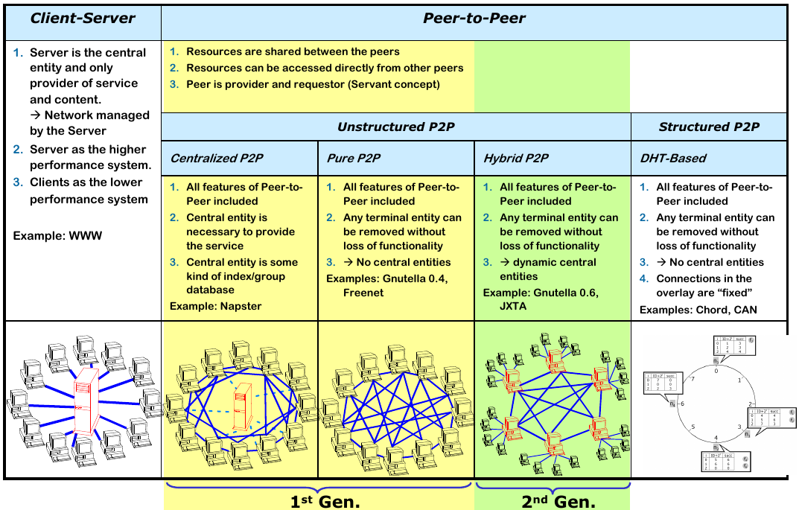

## The clustering coefficient

for **undirected** graphs:
```
        2 * e(v)
C(v) =  ----------------
        deg(v)(deg(v)-1)
```

for **directed** graphs:
```
        e(v)
C(v) =  ----------------
        deg(v)(deg(v)-1)
```

e(v) denotes the number of connections of v’s neighbors that are connected with each other. Which means the number of edges that connect v's neigbors.

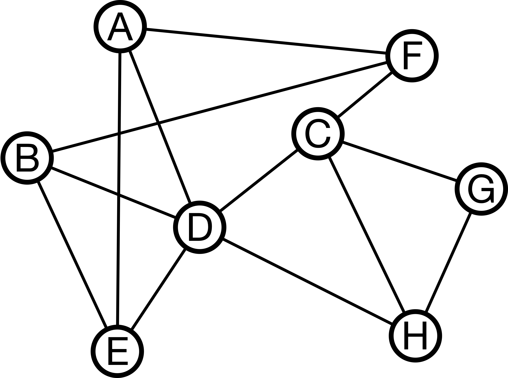

```
        2 * 2   4
C(c) =  ----- = --
        4 * 3   12

Calculating e(v) = 2:
1.edge (D,H)
2.edge (H,G)
```

## Graph network models

### Power-Law Network

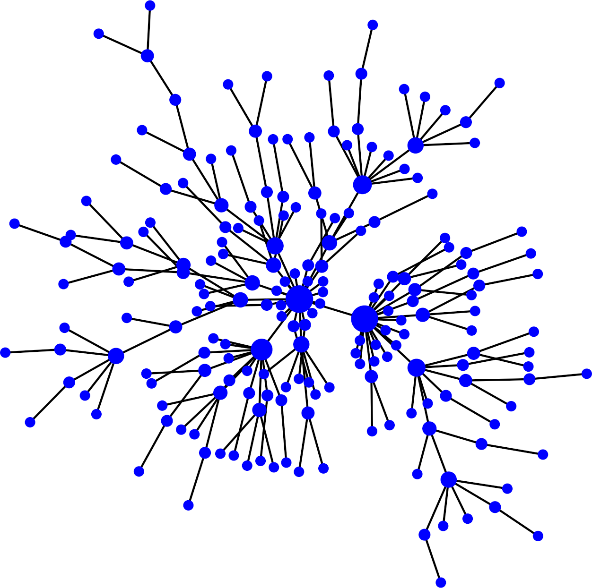

### Random Network

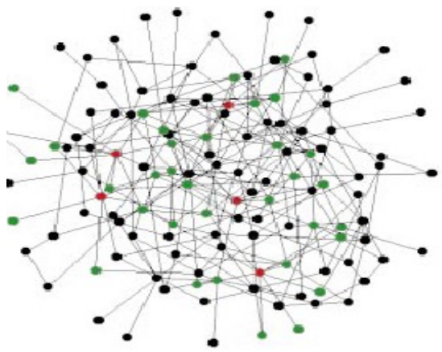

### Grid Network

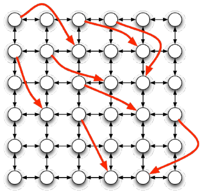

### Watts-Strogatz Random Network

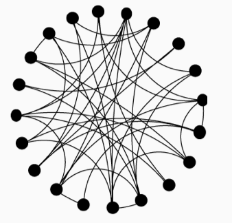

## P2P ISO/OSI model

P2P systems reside on the Layer 7 (Application Layer).

## Number of messages created in a flooding of a request in Gnutella

* Gnutella 0.4 system
* N = 11 connections per node
* T = 4 (Time to live)

Number of messages:

$$\sum\limits_{i=0}^{T-1} N (N-1)^i$$

## Watts-Strogatz network

How many hops, based on the number of vertices n, does it take in the worst case to route a message between any two nodes? $(p=0, k = 3)$

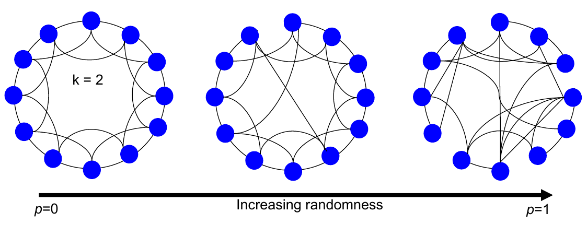

Consider two nodes that reside in the network side by side. In worst case, the message needs to go all the way around the ring to reach the previous node.

So, It takes in worst-case `O(n)` hops.

## P2P False-negatives

In some P2P systems, so-called false-negatives can occur (a data item is not found, although it is present in the network). In which P2P systems can such a false-negative occur?

* Hybrid P2P
* Pure P2P

## Pure P2P Network

Consider a Pure P2P network consistent of N peers, every peer knows at least two other peers. In the worst possible case, what is the lowest number of independent peer failures sufficient to partition such a network?

To answer this question consider the following case. We have two ring networks, where in each network every node knows at least two other nodes. And there is a node $N_x$ connecting both ring networks. In this total network, all properties hold. And now, if we remove the peer $N_x$, the graph will be partitioned into two ring networks.

So, the answer is 1.

# Quiz 2 - Small World/DHTs/Chord

## Random networks against power-law networks

Random networks are more robust against **Targeted Attacks** than power-law networks.

## Generate a small-world network

The Watts-Strogatz Model can be used to create a small-world network.

Steps:
1. Build a ring of n vertices and connect each vertex with its k clockwise neighbors on the ring
2. Draw a random number between 0 and 1 for each edge
3. Rewire each edge with probability p: if the edge‘s random number is smaller than p, keep the source vertex of the edge fixed, and choose a new target vertex uniformly at random from all other vertices

Somewhere between $p=0$ and $p=1$ we get a Small World Network, where the clustering coefficient **C** is high and the shortes path length **L** is low.

## Chord Ring


The chord ring structure is represented as a ring. There are two types of nodes here:
* Nodes
* Identifiers

Each node has a key and holds a finger table. (key, value) pairs managed by clockwise next node: successor.

Here's an example finger table for **Node 0**:

| i   | start | succ | keys | pred |
| --- | ----- | ---- | ---- | ---- |
| 0   | 1     | 1    | 6    | 3    |
| 1   | 2     | 3    |
| 2   | 4     | 0    |

* With **N** nodes in the ring, we have $log(N)$ rows in the table.
* For a node $N_x$ the **start** cell is equal to $N_x + 2^i \space mod(N)$.
* The **succ** cell shows which node is the successor for the start value. If the start value itself is a node, than the successor is the same node.

The **Node 0** holds in total 6 keys, including itself. And its predecessor is the **Node 3**.

### Example for a chord ring finger table:

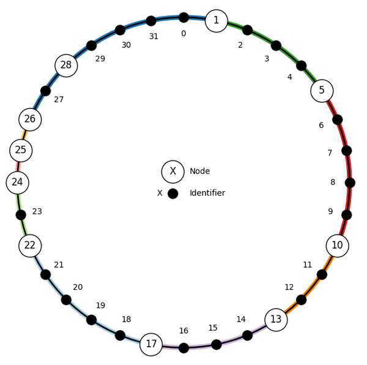

We calculate the finger table for **Node 24**:

* With 32 addresses in total, we need $log(32) = 5$ rows in our finger table.

| i   | start | successor |
| --- | ----- | --------- |
| 0   | 25    | 25        |
| 1   | 26    | 26        |
| 2   | 28    | 28        |
| 3   | 0     | 1         |
| 4   | 8     | 10        |

## Possible node IDs for node n

A **Node n** participates In a Chord ring. It has the following finger table:

| finger | node ID |
| ------ | ------- |
| 0      | 8       |
| 1      | 8       |
| 2      | 10      |
| 3      | 0       |

Which are possible node IDs for **Node n** based on the above finger table?

Things we can learn from the finger table:
* Because we have 4 rows in our table, the chord ring has in total **16** addresses.
* The addresses 0, 8, 10 are nodes.

From the finger values we have the following deduction:
* $n+1$ goes to Node 8
* $n+2$ goes to Node 8
* $n+4$ goes to Node 10
* $n+8$ goes to Node 0

Therefore, our **Node n** can't be bigger than 6, because otherwise n+2 would be bigger than Node 8 and the nodes work only in clockwise.

Also, our **Node n** can't be smaller than 5, because otherwise, n+4 would go to Node 8 instead of Node 10.

So, our possible node IDs for **Node n** are 5 and 6.

## File retrieval in a Chord Ring

Consider the given Chord ring. You are looking for a copy of the New York Times from Jul 4th, 2006, which is stored in the Chord ring as NYT_2006-04-07.pdf with ID 18, i.e., Hash("NYT_2006-04-07.pdf")=18

Which node would you have to contact to retrieve a copy of the requested file? Give the correct node ID.

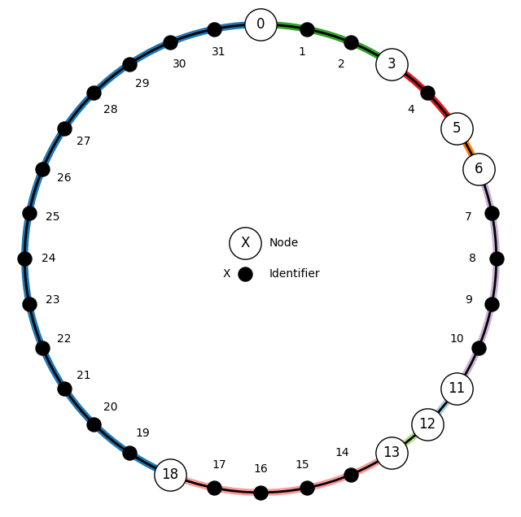

The hash value of the filename is 18. And also, 18 is a node. So, we would just contact that node to retrieve the file.

## Search request in a Chord Ring

Assume you have given the following Chord-Ring:


Now assume, that node 12 wants to retrieve the data item with the ID = 5.

State which node receives the search request in each step of forwarding it.

* We calculate the finger table for node 12:

| finger | node id |
| ------ | ------- |
| 0      | 0       |
| 1      | 0       |
| 2      | 0       |
| 3      | 6       |

The biggest node id smaller than 5 is 0. We forward the request to node 0.

* We calculate the finger table for node 0:

| finger | node id |
| ------ | ------- |
| 0      | 3       |
| 1      | 3       |
| 2      | 6       |
| 3      | 12      |

The biggest node id smaller than 5 is 3. We forward the request to node 3.

* We calculate the finger table for node 0:

| finger | node id |
| ------ | ------- |
| 0      | 6       |
| 1      | 6       |
| 2      | 12      |
| 3      | 12      |

All node ids are bigger than 5 and our id is 3. So, node 6 possibly has the file. Forward the request to node 6.

Here's the whole search process:

| Steps                             | Node ID |
| --------------------------------- | ------- |
| First step in forwarding request  | Node 0  |
| Second step in forwarding request | Node 3  |
| Third step in forwarding request  | Node 6  |
| Fourth step in forwarding request | None    |

## Chord ring with several hash functions

What are potential benefits of using several hash functions in a single Chord ring simultaneously?

* Load balancing
* Redundancy
* Smaller average path length

## Number of nodes in a DHT

Number of nodes in a DHT can't be unlimited, as any hash function only outputs a limited number of hashes.

# Quiz 3 - i3 and Bitcoin

## Multicast via i3

This is how the triggers can be used to realize multicast via i3.

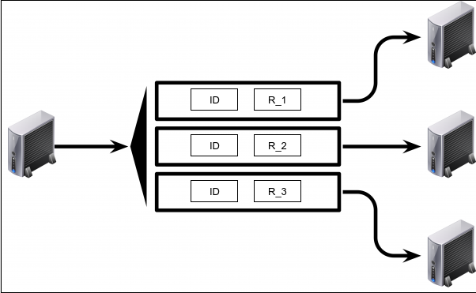

## P2P infrastructure for i3

The **DHT** P2P infrastructure is used to operate i3.

## Mobility in i3

Who is allowed to be mobile in i3?

* Sender
* Receiver

## i3 partners knowledge

In plain i3, communication partners **can not** learn their physical location.

## Bitcoin Transactions

In a blockchain network, when Alice issues a new Bitcoin transaction, **all nodes** receive Alice's submitted transaction.

## Copy of the blockchain

Also, established nodes store a full copy of the whole blockchain to **authenticate transactions**.

## Mined blocks

A mined block (which is valid) **may** become part of the blockchain.

## Maximum number of Bitcoins

The maximum number of Bitcoins is 21 million. The number of new bitcoins created each year is automatically halved over time until bitcoin issuance halts completely with a total of 21 million bitcoins in existence.

## Verifying a transaction

Digital signatures play an essential role in verifying that an attempted payment is authorized.

## Merkle tree

Consider the case where Bitcoin transactions are integers $t_i \in \Z_{17}$, i.e., $0 \le t_i \le 17$ and the Merkle tree uses the hash function $h(x)=6x+4\space mod(11)$.

Compute the Merkle tree root  and give the number of hash operations you performed along the way for the following ordered set of transactions to include in your block.

| $t_1$ | $t_2$ | $t_3$ | $t_4$ | $t_5$ | $t_6$ | $t_7$ | $t_8$ |
| ----- | ----- | ----- | ----- | ----- | ----- | ----- | ----- |
| 1     | 9     | 15    | 11    | 8     | 4     | 13    | 14    |

We compute the Merkle tree (sideways) as follows:
```
(1)  -> 10 |
           | (10+3) -> 5 |
(9)  -> 3  |
                         | (5+9) -> 0  |
(15) -> 6  |
           | (6+4)  -> 9 |
(11) -> 4  |
                                       | (0+10) -> [9]
(8)  -> 8  |
           | (8+6)  -> 0 |
(4)  -> 6  |
                         | (0+1) -> 10 |
(13) -> 5  |
           | (5+0)  -> 1 |
(14) -> 0  |
```

The Merkle tree root is 9. We performed in total 15 hash operations.

# Quiz 4 - Cloud

## Scalability

* Scale-out: `increasing the number of devices and distributing tasks to them called`
* Scale-up: `replacing devices with more powerful devices`

## Cassandra

What logical structure is used by Cassandra to decide where data is stored?

* DHT

## Distributed System Properties

In a distributed system you can satisfy at most 2 out of the following 3 properties:

* Consistency
* Availability
* Partition-tolerance

Cassandra is a distributed system.

Cassandra's architecture does not provide consistency.

## Cassandra's front-end

Why are multiple replicas fetched by Cassandra's front-end node?

* used to guarantee consistent results, since different versions of an item might exist

## Bloomfilter key insertion

You are given a Bloomfilter that consists of $m=11$ memory bits and three hash functions $f_1$, $f_2$ and $f_3$

defined as below:
* $f_1(x)=x\space mod(m)$
* $f_2(x)=(17⋅x)\space mod(m)$
* $f_3(x)=(23⋅x)\space mod(m)$

where x is a given key. Assume that all m bits of the Bloomfilter are initially set to 0 and the bits are numbered from right to left.

Show the Bloomfilter bits following the insertion of the keys 9 and 42.

Calculation:
* $f_1(9) = 9$
* $f_2(9) = 10$
* $f_3(9) = 9$
* $f_1(42) = 9$
* $f_2(42) = 10$
* $f_3(42) = 9$

Bloomfilter bits:

| 10  | 9   | 8   | 7   | 6   | 5   | 4   | 3   | 2   | 1   | 0   |
| --- | --- | --- | --- | --- | --- | --- | --- | --- | --- | --- |
| 1   | 1   | 0   | 0   | 0   | 0   | 0   | 0   | 0   | 0   | 0   |

## Speedup through parallelization

Suppose that we parallelize a program to run on $n$ processors and only a portion $p$ of the program can be parallelized.

We can compute the speedup S as follows:

$$S=\frac{1}{(1-p)+\frac{p}{n}}$$

## Amdahl's Law

Amdahl‘s law only gives an upper bound and the speedup is not always achievable.

## MapReduce

MapReduce is a programming model for processing and generating large data sets.

* Chunks are processed in isolation by tasks called Mappers
  * Implementing map function
* The intermediate outputs of the Mappers are further processed by the Reducers
  * Implementing reduce function
* Assigning intermediate outputs to Reducers is done by partitioner
  * Consistency: records with the same intermediate key must end up at the same Reducer
* Reducers produce the final outputs

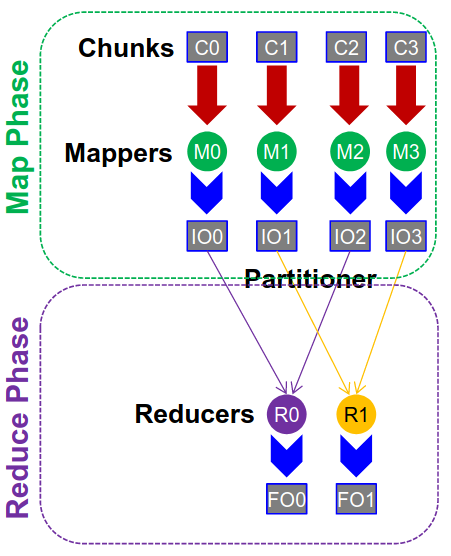

* All records with the same key are processed by the same reducer.

## Speculative execution

What is speculative execution used for?

to deal with noticeably slow tasks

# Quiz 5 - CPS

## Components of a sensor

Which components of a sensor node are not among the most relevant ones considering the device's energy consumption?

* Battery
* Storage
* Memory

## Energy consumption

Which of the following operational tasks demands the least energy in general?

* Transmission of data
* Computation operations
* Receiving data

**Computation operations use the least energy**

## Processor power consumption

Which characteristics **directly** influence the power consumption of a processor?

* clock frequency
* voltage

## Data aggregation

What are typical metrics for data aggregation?

* accuracy
* completeness
* message overhead

## In-network-processing

Use in-network-processing to compute the average in the following network. Fill in the messages sent by the nodes and the computed average at the sink S with only the provided information.

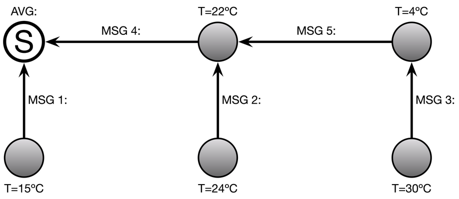

Calculation (from right to left):
* MSG 3 contains the value $<30, 1>$, as it only has the information of 30°C.
* MSG 5 has to include both degrees, so it contains the sum of 30°C and 4°C. Therefore it holds the value $<34,2>$.
* MSG 2 has the value $<24,1>$, as it only has the information of 24°C.
* MSG 4 has to include three degrees to contain the sum of 24, 22 and the degree 34 coming from MSG 5. Therefore it holds the value $<80, 4>$.
* MSG 1 has only one degree and therefore holds the value $<15, 1>$.
* The sink S now has to compute the average of all degrees. It gets both messages 1 and 4. So it calculates the average for the value $<95,5 >$ which computes to 19.

The average is 19°C.

## Multi-hop routing

What makes multi-hop routing in real-world scenarios difficult?

* asymmetric links
* volatile channel quality

## Multi-hop with ETX metric

Given is the following Multi-Hop topology and you would like to transmit data from A to E and back.

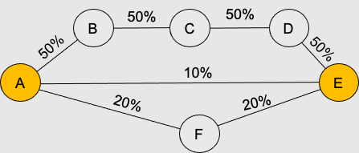

The numbers at the links denote the FDR and RDR (FDR=RDR). Which is the best route w.r.t. the ETX Metric?

To calculate the ETX metric, you have to calculate the ETX value for each link and then sum them up.

$$ETX = 1/(d_f \cdot d_r)$$

* Forward delivery ratio (FDR): $d_f$
  * The probability that a data packet successfully arrives at the recipient

* Reverse delivery ratio (RDR): $d_r$
  * The probability that the ACK packet is successfully received

Usually, the FDR and RDR are the same.

Calculation for the picture:

We have 3 possible routes:
* A-B-C-D-E
* A-E
* A-F-E

We now calculate all ETX values for each link and sum them up for the route:
* A-B-C-D-E = 16
  * A-B: $1/0.25 = 4$
  * B-C: $1/0.25 = 4$
  * C-D: $1/0.25 = 4$
  * D-E: $1/0.25 = 4$
* A-E = 100
  * A-E: $1/0.01 = 100$
* A-F-E = 50
  * A-F: $1/0.04 = 25$
  * F-E: $1/0.04 = 25$

So, the best route is **A-B-C-D-E**.

## Routing protocols

Routing protocols that are reactive protocols:
* DSR
* AODV

## OLSR multipoint relays
Use OLSR to choose the multipoint relays of node A for the following network.

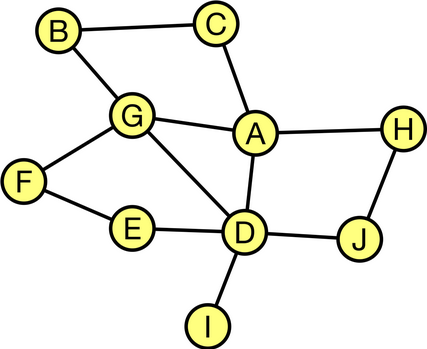

Calculation:

We have the following possible relay nodes: B,C,D,E,F,G,H,I,J
* Node A forwards its packets to C,D,G,H
* Nodes B,E,F,I,J did not receive any packets.
* Node I is only reachable through node D. So, make it a multipoint relay.
* IF node D is a multipoint relay, then it forwards messages to nodes E, I, J.
* Now, only nodes B and F did not receive any packets.
* Nodes B and F have one common neighbor, node G.
* So, we also make node G a multipoint relay.

The multipoint relays are therefore **D** and **G**.

## BVR routing protocol

Consider the following network with symmetric links. The yellow node is the starting node, while the blue one is the destination. Red nodes are representing beacons.

Enter the list of hops in the following way: nstart,n1r1,…,nkrk,ndest
where n is the node-number and r is the reason why the node was chosen.

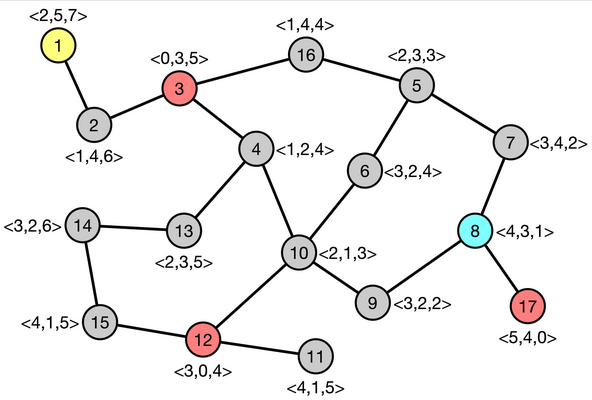

Calculating the route from Node 1 to Node 8:

To decide next hop:

* Neighbor with the smallest distance to destination $\delta^+$-distance has strict precedence over $\delta^-$-distance.

### Hop 1: Node 1

Node 1 <2,5,7>:  
We calculate two values:
* <2,5,7> - <4,3,1> = <0,2,6> = 8
* <4,3,1> - <2,5,7> = <2,0,0> = 2
* Therefore the distance is (8,2).

Node 2 <1,4,6>:

| Node | Dist. V+ | $\delta^+$ | Dist. V- | $\delta^-$ |
| ---- | -------- | ---------- | -------- | ---------- |
| 2    | <0,1,5>  | 6          | <3,0,0>  | 3          |

-> Next hop: Node 2 (only choice...)

---

### Hop 2: Node 2

| Node | Dist. V+ | $\delta^+$ | Dist. V- | $\delta^-$ |
| ---- | -------- | ---------- | -------- | ---------- |
| 1    | <0,2,6>  | 8          | <2,0,0>  | 2          |
| 3    | <0,0,4>  | 4          | <3,0,0>  | 4          |

-> Next hop: Node 3 (only choice...)

---

### Hop 3: Node 3

| Node | Dist. V+ | $\delta^+$ | Dist. V- | $\delta^-$ |
| ---- | -------- | ---------- | -------- | ---------- |
| 2    | <0,1,5>  | 6          | <3,0,0>  | 3          |
| 4    | <0,0,3>  | 3          | <3,1,0   | 4          |
| 16   | <0,1,3>  | 4          | <3,0,0>  | 3          |

-> Next hop: Node 4 ($\delta^+$ has precedence over $\delta^-$)

---

### Hop 4: Node 4

| Node | Dist. V+ | $\delta^+$ | Dist. V- | $\delta^-$ |
| ---- | -------- | ---------- | -------- | ---------- |
| 3    | <0,0,4>  | 4          | <3,0,0>  | 4          |
| 10   | <0,0,2>  | 2          | <2,2,0>  | 4          |
| 13   | <0,0,4>  | 4          | <2,0,0>  | 2          |

-> Next hop: Node 10 ($\delta^+$ has precedence over $\delta^-$)

---

### Hop 5: Node 10

| Node | Dist. V+ | $\delta^+$ | Dist. V- | $\delta^-$ |
| ---- | -------- | ---------- | -------- | ---------- |
| 4    | <0,0,3>  | 3          | <3,1,0>  | 4          |
| 6    | <0,0,3>  | 3          | <1,1,0>  | 2          |
| 9    | <0,0,1>  | 1          | <1,1,0>  | 2          |
| 12   | <0,0,3>  | 3          | <1,3,0>  | 4          |

-> Next hop: Node 9

---

### Hop 6: Node 9

-> Next hop: Node 8 (destination reached)

## Quiz 6 - IoT


## Quiz 7 - SDN and NFV

## Quiz 8 - QoS