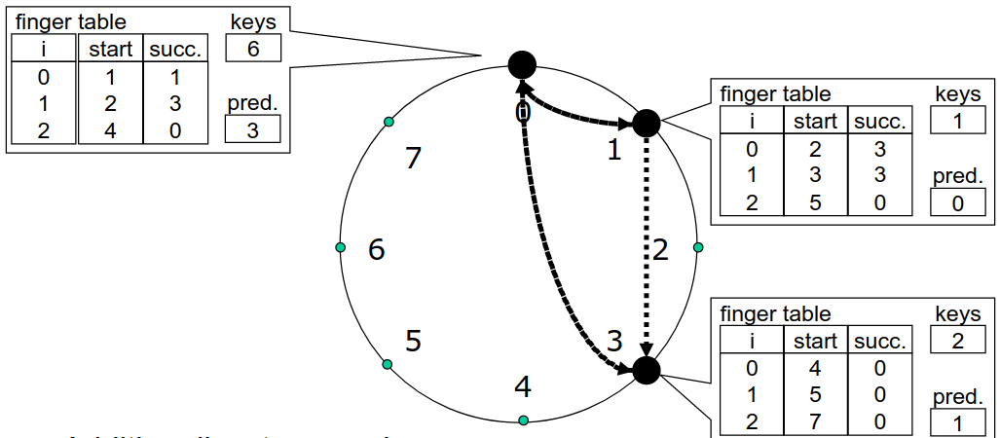
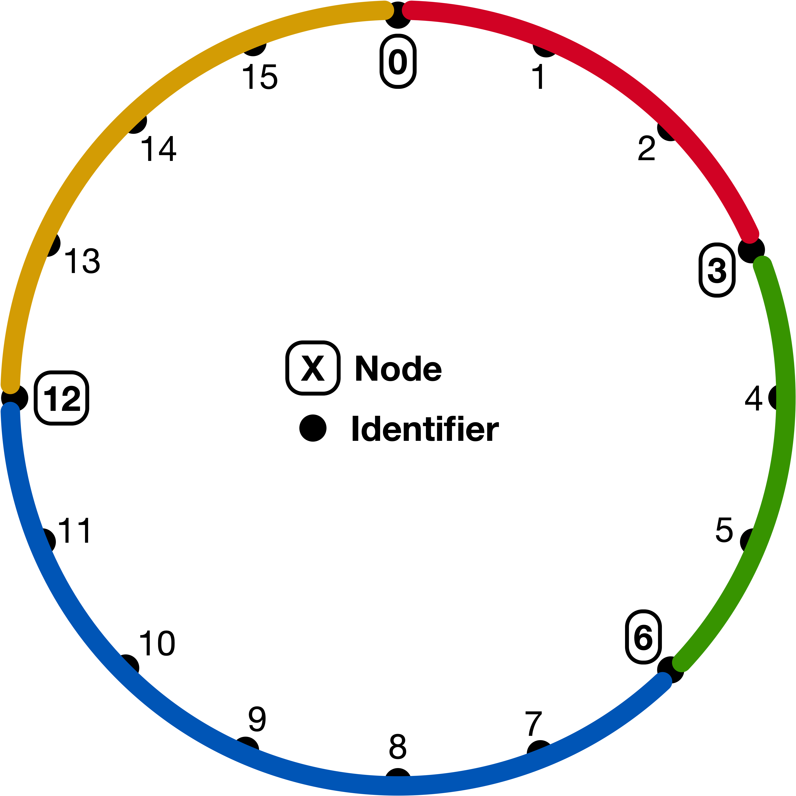

# Notes

# Quiz 1 - P2P and Small World

## P2P Networks


## The clustering coefficient

```
        2 * e(v)
C(v) =  ----------------
        deg(v)(deg(v)-1)
```

e(v) denotes the number of connections of v’s neighbors that are connected with each other. Which means the number of edges that connect v's neigbors.


```
        2 * 2   4
C(c) =  ----- = --
        4 * 3   12

Calculating e(v) = 2:
1.edge (D,H)
2.edge (H,G)
```

## Graph network models

### Power-Law Network


### Random Network


### Grid Network


### Watts-Strogatz Random Network


## P2P ISO/OSI model

P2P systems reside on the Layer 7 (Application Layer).

## Number of messages created in a flooding of a request in Gnutella

* Gnutella 0.4 system
* N = 11 connections per node
* T = 4 (Time to live)

Number of messages = $\sum\limits_{i=0}^{T-1} N (N-1)^i$

## Watts-Strogatz network

How many hops, based on the number of vertices n, does it take in the worst case to route a message between any two nodes? $(p=0, k = 3)$


Consider two nodes that reside in the network side by side. In worst case, the message needs to go all the way around the ring to reach the previous node.

So, It takes in worst-case `O(n)` hops.

## P2P False-negatives

In some P2P systems, so-called false-negatives can occur (a data item is not found, although it is present in the network). In which P2P systems can such a false-negative occur?

* Hybrid P2P
* Pure P2P

## Pure P2P Network

Consider a Pure P2P network consistent of N peers, every peer knows at least two other peers. In the worst possible case, what is the lowest number of independent peer failures sufficient to partition such a network?

To answer this question consider the following case. We have two ring networks, where in each network every node knows at least two other nodes. And there is a node $N_x$ connecting both ring networks. In this total network, all properties hold. And now, if we remove the peer $N_x$, the graph will be partitioned into two ring networks.

So, the answer is 1.

# Quiz 2 - Small World/DHTs/Chord

## Random networks against power-law networks

Random networks are more robust against **Targeted Attacks** than power-law networks.

## Generate a small-world network

The Watts-Strogatz Model can be used to create a small-world network.

Steps:
1. Build a ring of n vertices and connect each vertex with its k clockwise neighbors on the ring
2. Draw a random number between 0 and 1 for each edge
3. Rewire each edge with probability p: if the edge‘s random number is smaller than p, keep the source vertex of the edge fixed, and choose a new target vertex uniformly at random from all other vertices

Somewhere between $p=0$ and $p=1$ we get a Small World Network, where the clustering coefficient **C** is high and the shortes path length **L** is low.

## Chord Ring



The chord ring structure is represented as a ring. There are two types of nodes here:
* Nodes
* Identifiers

Each node has a key and holds a finger table. (key, value) pairs managed by clockwise next node: successor.

Here's an example finger table for **Node 0**:

| i   | start | succ | keys | pred |
| --- | ----- | ---- | ---- | ---- |
| 0   | 1     | 1    | 6    | 3    |
| 1   | 2     | 3    |
| 2   | 4     | 0    |

* With **N** nodes in the ring, we have $log(N)$ rows in the table.
* For a node $N_x$ the **start** cell is equal to $N_x + 2^i \space mod(N)$.
* The **succ** cell shows which node is the successor for the start value. If the start value itself is a node, than the successor is the same node.

The **Node 0** holds in total 6 keys, including itself. And its predecessor is the **Node 3**.

### Example for a chord ring finger table:


We calculate the finger table for **Node 24**:

* With 32 addresses in total, we need $log(32) = 5$ rows in our finger table.

| i   | start | successor |
| --- | ----- | --------- |
| 0   | 25    | 25        |
| 1   | 26    | 26        |
| 2   | 28    | 28        |
| 3   | 0     | 1         |
| 4   | 8     | 10        |

## Possible node IDs for node n

A **Node n** participates In a Chord ring. It has the following finger table:

| finger | node ID |
| ------ | ------- |
| 0      | 8       |
| 1      | 8       |
| 2      | 10      |
| 3      | 0       |

Which are possible node IDs for **Node n** based on the above finger table?

Things we can learn from the finger table:
* Because we have 4 rows in our table, the chord ring has in total **16** addresses.
* The addresses 0, 8, 10 are nodes.

From the finger values we have the following deduction:
* $n+1$ goes to Node 8
* $n+2$ goes to Node 8
* $n+4$ goes to Node 10
* $n+8$ goes to Node 0

Therefore, our **Node n** can't be bigger than 6, because otherwise n+2 would be bigger than Node 8 and the nodes work only in clockwise.

Also, our **Node n** can't be smaller than 5, because otherwise, n+4 would go to Node 8 instead of Node 10.

So, our possible node IDs for **Node n** are 5 and 6.

## File retrieval in a Chord Ring

Consider the given Chord ring. You are looking for a copy of the New York Times from Jul 4th, 2006, which is stored in the Chord ring as NYT_2006-04-07.pdf with ID 18, i.e., Hash("NYT_2006-04-07.pdf")=18

Which node would you have to contact to retrieve a copy of the requested file? Give the correct node ID.


The hash value of the filename is 18. And also, 18 is a node. So, we would just contact that node to retrieve the file.

## Search request in a Chord Ring

Assume you have given the following Chord-Ring:



Now assume, that node 12 wants to retrieve the data item with the ID = 5.

State which node receives the search request in each step of forwarding it.

* We calculate the finger table for node 12:

| finger | node id |
| ------ | ------- |
| 0      | 0       |
| 1      | 0       |
| 2      | 0       |
| 3      | 6       |

The biggest node id smaller than 5 is 0. We forward the request to node 0.

* We calculate the finger table for node 0:

| finger | node id |
| ------ | ------- |
| 0      | 3       |
| 1      | 3       |
| 2      | 6       |
| 3      | 12      |

The biggest node id smaller than 5 is 3. We forward the request to node 3.

* We calculate the finger table for node 0:

| finger | node id |
| ------ | ------- |
| 0      | 6       |
| 1      | 6       |
| 2      | 12      |
| 3      | 12      |

All node ids are bigger than 5 and our id is 3. So, node 6 possibly has the file. Forward the request to node 6.

Here's the whole search process:

| Steps                             | Node ID |
| --------------------------------- | ------- |
| First step in forwarding request  | Node 0  |
| Second step in forwarding request | Node 3  |
| Third step in forwarding request  | Node 6  |
| Fourth step in forwarding request | None    |

## Chord ring with several hash functions

What are potential benefits of using several hash functions in a single Chord ring simultaneously?

* Load balancing
* Redundancy
* Smaller average path length

## Number of nodes in a DHT

Number of nodes in a DHT can't be unlimited, as any hash function only outputs a limited number of hashes.

# Quiz 3 - i3 and Bitcoin

## Multicast via i3

This is how the triggers can be used to realize multicast via i3.


## P2P infrastructure for i3

The **DHT** P2P infrastructure is used to operate i3.

## Mobility in i3

Who is allowed to be mobile in i3?

* Sender
* Receiver

## i3 partners knowledge

In plain i3, communication partners **can not** learn their physical location.

## Bitcoin Transactions

In a blockchain network, when Alice issues a new Bitcoin transaction, **all nodes** receive Alice's submitted transaction.

## Copy of the blockchain

Also, established nodes store a full copy of the whole blockchain to **authenticate transactions**.

## Mined blocks

A mined block (which is valid) **may** become part of the blockchain.

## Maximum number of Bitcoins

The maximum number of Bitcoins is 21 million. The number of new bitcoins created each year is automatically halved over time until bitcoin issuance halts completely with a total of 21 million bitcoins in existence.

## Verifying a transaction

Digital signatures play an essential role in verifying that an attempted payment is authorized.

## Merkle tree

Consider the case where Bitcoin transactions are integers $t_i \in \Z_{17}$, i.e., $0 \le t_i \le 17$ and the Merkle tree uses the hash function $h(x)=6x+4\space mod(11)$.

Compute the Merkle tree root  and give the number of hash operations you performed along the way for the following ordered set of transactions to include in your block.

| $t_1$ | $t_2$ | $t_3$ | $t_4$ | $t_5$ | $t_6$ | $t_7$ | $t_8$ |
| ----- | ----- | ----- | ----- | ----- | ----- | ----- | ----- |
| 1     | 9     | 15    | 11    | 8     | 4     | 13    | 14    |

We compute the Merkle tree (sideways) as follows:
```
(1)  -> 10 |
           | (10+3) -> 5 |
(9)  -> 3  |
                         | (5+9) -> 0  |
(15) -> 6  |
           | (6+4)  -> 9 |
(11) -> 4  |
                                       | (0+10) -> [9]
(8)  -> 8  |
           | (8+6)  -> 0 |
(4)  -> 6  |
                         | (0+1) -> 10 |
(13) -> 5  |
           | (5+0)  -> 1 |
(14) -> 0  |
```

The Merkle tree root is 9. We performed in total 15 hash operations.

# Quiz 4 - Cloud